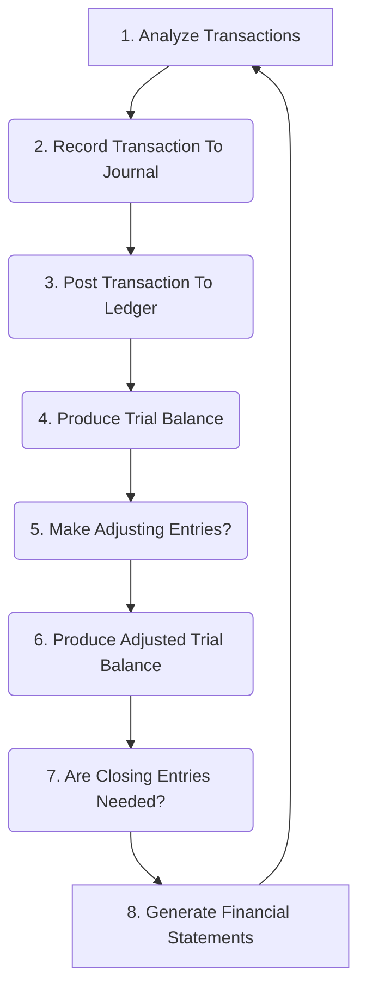

```mermaid
graph TD
    A[1. Analyze Transactions] --> B(2. Record Transaction To Journal)
    B --> C(3. Post Transaction To Ledger)
    C --> D(4. Produce Trial Balance)
    D --> E(5. Make Adjusting Entries?)
    E --> F(6. Produce Adjusted Trial Balance)
    F --> G(7. Are Closing Entries Needed?)
    G --> H[8. Generate Financial Statements]
    H --> A
```
